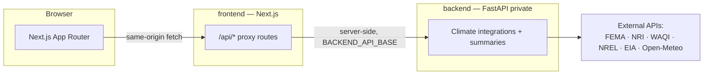

# Climate Risk Intelligence Platform — System Design

## Purpose

A small full-stack reference application with three interactive experiences: **login**, **business (institutional)** dashboard, and **consumer** dashboard. Visual language follows the provided reference screens (LoCal / ClimateHome).

## High-Level Architecture



The browser **only** talks to same-origin Next.js routes; those proxy server-side to
FastAPI. This keeps the backend private and ensures external-API keys live solely in
the FastAPI process — never shipped to the browser.

- **frontend/**: **Next.js** (App Router, React, TypeScript) serves the UI and exposes thin `/api/*` proxy routes. Demo auth uses **sessionStorage** in the browser (not production-grade).
- **backend/**: Python **FastAPI** — the single source of truth for climate-risk data. Owns all external integrations (FEMA NFHL, FEMA NRI, WAQI, NREL PVWatts, EIA, Open-Meteo; NOAA/ATTOM/FRED stubbed) and the dashboard summary derivations. Tolerates partial source failure (`asyncio.gather(return_exceptions=True)`); each request bounded by a configurable HTTP timeout.

## Responsibilities

| Layer | Responsibility |
|--------|----------------|
| Next.js | Routing (`/login`, `/business`, `/consumer`), layouts, CSS, interactivity, and `/api/*` proxy → FastAPI |
| FastAPI | Real climate data: `/api/health`, `/api/climate-intelligence`, `/api/summary/consumer`, `/api/summary/business`; config/secrets, structured logging, timeouts |
| Session | `sessionStorage` after login; **both** `/business` and `/consumer` are available; login choice only sets the **first** screen |

## Security Note (Demo)

Login accepts **any non-empty credentials** and is **not** production authentication. Replace with proper auth (e.g. NextAuth, Clerk, or OIDC) before any real deployment.

## Ports

- Frontend (Next.js): `3000` (`npm run dev`)
- Backend (FastAPI): `8000`

- **`BACKEND_API_BASE`** (server-only, in `frontend/.env.local`) points the Next.js proxy at FastAPI; defaults to `http://localhost:8000`.
- Backend secrets live in `backend/.env` (see `backend/.env.example`); all are optional and degrade gracefully when unset.

## Runbook

**Backend**

```bash
cd backend
python3 -m venv venv
source venv/bin/activate   # Windows: venv\Scripts\activate
pip install -r requirements.txt
uvicorn app.main:app --reload --port 8000
```

Run the backend test suite with `pytest` from the `backend/` directory.

**Frontend**

```bash
cd frontend
cp .env.example .env.local   # sets BACKEND_API_BASE=http://localhost:8000
npm install
npm run dev
```

Open `http://localhost:3000/login`. Choose **Business** or **Consumer**, enter any non-empty username and password.

**Production build**

```bash
cd frontend
npm run build
npm run start
```

## Repository Layout

```
SYSTEM_DESIGN.md
backend/
  app/
    main.py              # app factory: lifespan, CORS, router
    config.py            # pydantic-settings (secrets, timeout, origins)
    logging_config.py    # structured JSON logging
    http.py              # shared httpx client + fetch_json (timeouts)
    schemas.py           # response models
    api/routes.py        # health, climate-intelligence, summaries
    services/
      climate.py         # external integrations + aggregator
      summary.py         # consumer/business transformers (pure)
  tests/                 # pytest: transformers + routes (mocked)
  requirements.txt
  .env.example
  venv/                  # created locally, not committed
frontend/
  package.json
  src/app/api/           # thin proxy routes -> FastAPI
  src/lib/server/        # backendProxy.ts
  src/components/
```

## Production Readiness Roadmap

The backend move + foundational hardening (real backend in FastAPI, proxy topology,
config/secrets validation, structured logging, request timeouts, basic tests) is done.
Remaining work to reach production:

1. **Real authentication** — replace the `sessionStorage` demo session (`frontend/src/lib/auth.ts`) with NextAuth/OIDC or JWT + a server-side session; add role-based access for business vs consumer.
2. **CI/CD** — GitHub Actions: backend (ruff/mypy + `pytest`), frontend (eslint + `tsc` + `next build`) on every PR.
3. **Containerization** — `backend/Dockerfile` (gunicorn + uvicorn workers) and `frontend/Dockerfile`, plus `docker-compose.yml` for local; host-agnostic until a deploy target is chosen.
4. **Deployment** — build images, inject secrets from the platform's secret store, run behind TLS; pick a host (Vercel + managed Python, or containers anywhere).
5. **Resilience & observability** — rate limiting, response caching for slow upstreams, retries/circuit-breaker, metrics + error tracking (Sentry / OpenTelemetry).
6. **Finish real data** — wire NOAA/ATTOM/FRED; replace the demo-hardcoded business figures (`rate_increase_5y_pct`, `carriers_reducing` — marked `TODO(demo)` in `services/summary.py`).
7. **Secret management** — move from `.env` files to a managed secret store in deployed environments.
